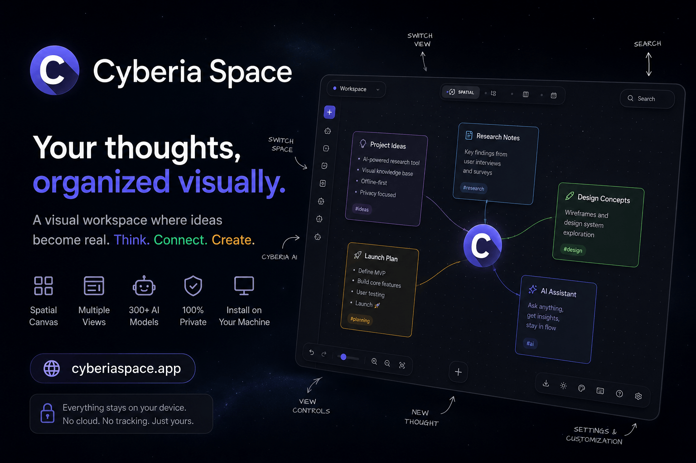

# Cyberia

A visual thinking space with four view modes — Spatial, Kanban, Calendar, and Directory — that transform the same data into different organizational metaphors. Ideas exist as physical objects on an infinite canvas, drift through a custom physics engine, snap into column-based workflows, align on a time grid, or surface through search and filters.



---

## Overview

Cyberia is a **local-only**, **open-source** productivity application designed for non-linear thinkers. It combines a real-time physics simulation with structured data management, allowing information to be arranged spatially, grouped into stacks, filtered by view mode, and augmented by an integrated AI assistant powered by **OpenRouter** (BYOK — Bring Your Own Key).

No authentication required. No cloud dependencies. Everything stays in your browser's IndexedDB.

The workspace supports four view modes — **Spatial**, **Kanban**, **Calendar**, and **Directory** — each transforming the same data into a different organizational metaphor without duplication.

---

## Architecture

### Two-Layer Data Flow

Data flows through two layers with strict ordering:

```
UI (React) ──reads──> Zustand Store ──persists──> IndexedDB
                            ^
                            │
                      Source of Truth
                      for all UI state
```

1. **Zustand** — In-memory state store. All UI components read from and write to Zustand. It is the single source of truth during active sessions.
2. **IndexedDB (Dexie)** — Persistent local database. Written to after every Zustand mutation. Used for app hydration on load and offline resilience.

### Key Design Decisions

- **Local-only**: All operations work offline. Zero network dependencies for basic functionality.
- **Physics engine**: A custom 2D engine manages thought positions, velocities, repulsion, and stack cohesion. Mode-specific layout strategies (spatial, kanban, calendar) transform the same data into different visual arrangements.
- **ULID identifiers**: All entities use ULIDs for collision-free operation and temporal sortability.
- **Single-user**: No authentication, no multi-user conflicts, no sync complexity.
- **Soft deletes**: Removed entities set a `deletedAt` tombstone for safety.

---

## Features

### Workspace Modes

| Mode | Description |
|------|-------------|
| **Spatial** | Free-form canvas. Thoughts drift, repel, and stack via physics simulation. |
| **Kanban** | Column-based layout for task and workflow management. |
| **Calendar** | Time-aligned grid where thoughts are organized by date. |
| **Directory** | Searchable list/table view with filtering and sorting. |

### Content Types

Seven thought types, each with a dedicated renderer and focus editor:

- **Label** — Lightweight headers and structural markers
- **Text** — Rich Markdown editing with live preview
- **Task** — Interactive checklists with progress tracking
- **Table** — Editable data grids with row/column management
- **Paint** — SVG-based sketching and diagrams
- **File** — Image, PDF, audio, and video uploads with thumbnail previews
- **Embed** — YouTube, Spotify, and other oEmbed players

### Cyberia AI (BYOK)

Cyberia AI is an integrated AI agent with two modes, powered by your own OpenRouter API key:

- **Chat mode** — Read-only research assistant. Can read files and analyze content.
- **Action mode** — Full workspace access. Can create, modify, and organize thoughts and stacks autonomously.

Supports 300+ models through OpenRouter. You bring your own API key — no subscription required.

### Customization

- **Dark and Light themes** with persistent preference across sessions
- **Custom accent colors** — primary, secondary, and node background colors are configurable
- **Node-level background color** override for visual differentiation

---

## Tech Stack

| Category | Technology |
|----------|-----------|
| Framework | React 19, TypeScript 5.9 |
| Build | Bun + Vite 7 |
| State | Zustand 5 |
| Local DB | Dexie.js 4 (IndexedDB) |
| Styling | Tailwind CSS 4, CSS custom properties |
| Animation | Framer Motion 12 |
| AI | OpenRouter SDK |
| Package Manager | Bun |
| Icons | Lucide React |
| ID Generation | ULID |
| PWA | vite-plugin-pwa |


---

## Getting Started

```bash
git clone https://github.com/anas1412/cyberia.git
cd cyberia
bun install
bun run dev
```

The development server starts at `http://localhost:5173`.

### Build

```bash
bun run build    # TypeScript check + Vite production build
```

### Testing

Tests use **Bun's built-in test runner** (no Vitest/Jest needed). Three test groups cover the AI integration:

```bash
# Run all tests
bun test

# Run specific test groups
bun test src/tests/ai/toolParser.test.ts    # 23 tests — pure function, no deps
bun test src/tests/ai/executor.test.ts      # 52 tests — store-mocked, all tools + security
bun test src/tests/constants.test.ts        # 20 tests — configuration values

# Run integration tests (requires .env with API keys)
cp .env.example .env           # fill in your keys
bun test --timeout 30000 src/tests/ai/api-integration.test.ts
```

Integration tests hit **real APIs** (OpenRouter + Tavily) and skip gracefully when keys or network are unavailable — no hard failures.

### Configuration

Set your OpenRouter API key to enable Cyberia AI:

| Variable | Purpose |
|----------|---------|
| `VITE_OPENROUTER_API_KEY` | OpenRouter API key for Oracle AI |

Oracle is fully optional — the workspace works without it.

---

## Project Structure

```
src/
├── components/       # React components (Viewport, ThoughtNode, Toolbar, editors, overlays)
├── store/            # Zustand slices (canvas, data, history, thought, space, stack, ui)
├── services/         # AI executor, supporting services
├── hooks/            # Physics engine, camera, viewport gestures, layout strategies
├── utils/            # File helpers, date utils, embeds, migrations, settings
├── types/            # Zod schemas for validation
└── db.ts             # Dexie schema definition
```

---

## License

MIT. See [LICENSE](./LICENSE) for details.
